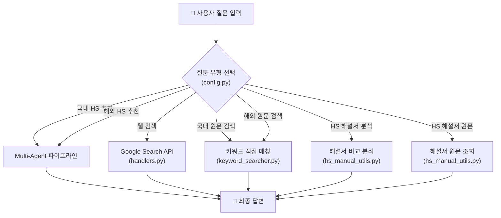
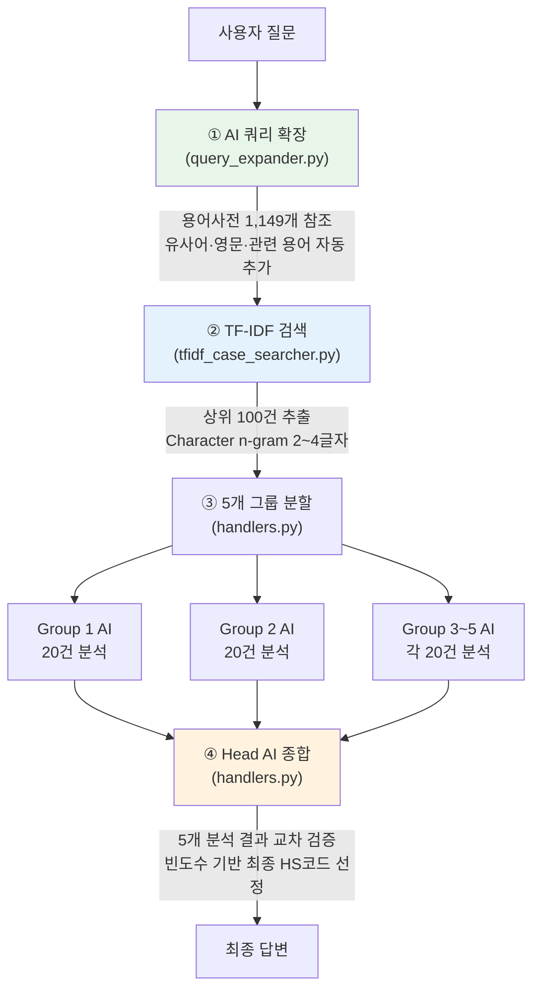
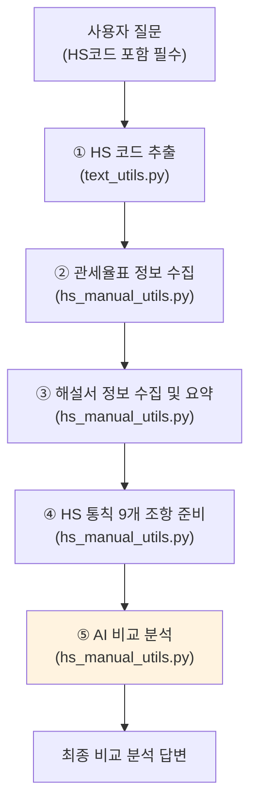
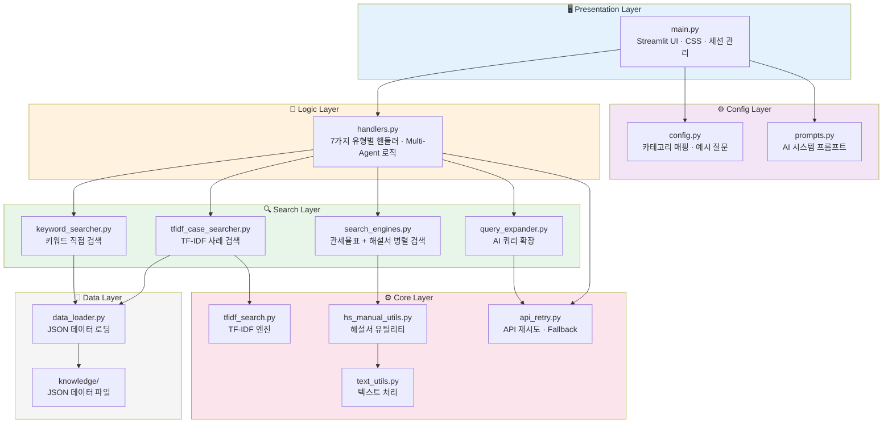
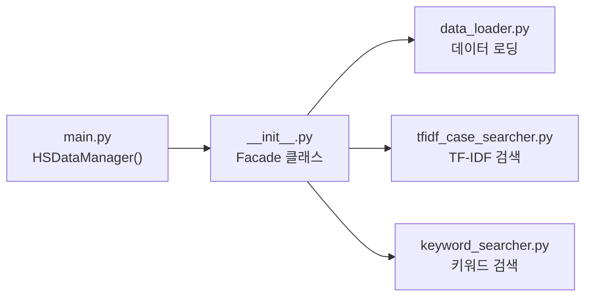

# HS 품목분류 챗봇 (슬기로운 품목분류 생활)

**HS 품목분류 사례 및 해설서 전문 AI 챗봇** — 무료 Gemini API 기반

  

- 💰 **완전 무료** — Google Gemini 무료 API로 구동
- 🤝 **Multi-Agent 병렬 분석** — 5개 AI가 동시 분석 후 Head AI가 종합
- ⚡ **하이브리드 RAG** — AI 쿼리 확장 + TF-IDF Character n-gram 검색

---

<details open>
<summary><b>📑 목차</b></summary>

- [💬 데모 시나리오](#-데모-시나리오-led-무드등-수입-업무)
- [🚀 빠른 시작](#-빠른-시작)
- [🔄 질문 유형별 동작 원리](#-질문-유형별-동작-원리)
- [🏗️ 시스템 아키텍처](#️-시스템-아키텍처)
- [📊 데이터](#-데이터)
- [💎 핵심 기술 상세](#-핵심-기술-상세)
- [⚠️ 한계 및 주의사항](#️-한계-및-주의사항)
- [📄 라이선스 / 개발자 정보](#-라이선스--개발자-정보)

</details>

---

## 💬 데모 시나리오: LED 무드등 수입 업무

캐릭터 피규어 하우스 LED 무드등을 수입하려는 상황을 예시로, 5단계 활용 시나리오를 소개합니다.

### 1️⃣ 웹 검색
> **"LED 무드등의 기술 사양과 시장 동향, 주요 용도는?"**
> → LED 조명 기술 현황, 인테리어 소품 시장, 수면등/분위기 조명 용도 확인

### 2️⃣ 국내 HS 분류사례 검색
> **"LED 충전식 무드등은 어떤 HS코드로 분류되나요?"**
> → 9405.21-0000 (전기식 탁상용/침대용 램프) **14건 확인**, Multi-Agent 병렬 분석

### 3️⃣ 해외 HS 분류사례 검색
> **"미국과 EU에서 LED lamp, mood light 분류 사례는?"**
> → 미국 CBP 27건, EU BTI 292건 분석

### 4️⃣ HS 해설서 비교 분석
> **"9405.21과 9503 중 어디에 분류되는지 해설서와 통칙으로 비교 분석해줘"**
> → 9405.21-0000 최종 선정 (통칙 3, 본질적 특성은 조명 기능)

### 5️⃣ HS 해설서 원문 검색
> **"9405.21"**
> → 해당 HS 코드의 해설서 원문을 구조화된 형태로 제공

---

## 🚀 빠른 시작

### 필수 준비물
- **Python 3.13+** 및 인터넷 연결
- **Google API Key** (무료): [Google AI Studio](https://aistudio.google.com/apikey)에서 발급

### 설치 및 실행

```bash
# 1. 프로젝트 다운로드
git clone https://github.com/YSCHOI-github/kcs_hs_chatbot
cd kcs_hs_chatbot

# 2. 라이브러리 설치
pip install -r requirements.txt

# 3. API 키 설정 (.env 파일 생성)
echo GOOGLE_API_KEY=여기에_발급받은_키_입력 > .env

# 4. 실행
streamlit run main.py
```

브라우저에서 `http://localhost:8501`로 접속하여 사용합니다.

### 주요 의존성

| 패키지 | 용도 |
|:---|:---|
| `streamlit` | 웹 애플리케이션 프레임워크 |
| `google-genai` | Gemini AI 모델 연동 |
| `scikit-learn` | TF-IDF 벡터화 (Vectorizer) |
| `numpy`, `pandas` | 데이터 처리 |
| `python-dotenv` | 환경변수 (.env) 관리 |

---

## 🔄 질문 유형별 동작 원리

사용자는 UI 상단의 라디오 버튼으로 7가지 질문 유형 중 하나를 선택합니다. 각 유형은 서로 다른 처리 파이프라인을 거칩니다.

### 전체 흐름 개요



---

### 1. 🔍 웹 검색 (`web_search`)

**용도**: 물품 개요, 기술 동향, 시장 현황 등 일반 정보 탐색

**처리 흐름**:
1. 사용자 질문 + 대화 컨텍스트를 Gemini API에 전달
2. Google Search API 도구를 활용하여 실시간 웹 검색 수행
3. 검색 결과를 종합하여 답변 생성

**관련 파일**: `handlers.py` → Gemini API (Google Search 도구 연동)

---

### 2. 🇰🇷 국내 분류사례 기반 HS 추천 (`domestic_hs_recommendation`)

**용도**: 관세청 987건의 국내 분류사례를 AI가 분석하여 HS 코드 추천



**세부 절차**:

| 단계 | 처리 내용 | 관련 파일 | AI 모델 |
|:---|:---|:---|:---|
| ① 쿼리 확장 | 물품명·재질·성분·기능 식별, 한글/영문 유사어 생성 | `query_expander.py` | Gemini 2.5 Flash Lite |
| ② TF-IDF 검색 | 확장된 쿼리를 2~4글자로 분해, 코사인 유사도 기반 상위 100건 추출 | `tfidf_case_searcher.py` → `tfidf_search.py` | — |
| ③ 그룹 분할 | 100건을 5개 그룹(각 20건)으로 분할 | `handlers.py` | — |
| ④ 병렬 분석 | 5개 Group AI가 동시에 각 그룹 분석 (ThreadPoolExecutor) | `handlers.py` | Gemini 2.5 Flash |
| ⑤ Head AI 종합 | 5개 분석 결과를 교차 검증, 빈도수 기반 최종 HS코드 선정 | `handlers.py` + `prompts.py` | Gemini 3.0 Flash Preview |

---

### 3. 📋 국내 분류사례 원문 검색 (`domestic_case_lookup`)

**용도**: 키워드로 분류사례 원문을 직접 검색 (AI 분석 없음, 즉시 결과)

**처리 흐름**:
1. 입력값 유형 판별 (참고문서번호 / HS 코드 / 일반 키워드)
2. 해당 방식으로 국내 987건 사례 데이터에서 직접 매칭 검색
3. 카드형 검색 결과 표시 (검색어 하이라이트, 최대 10건)

**검색 입력 예시**:
- 참고문서번호: `품목분류2과-9433`
- HS 코드: `5515.12`
- 키워드: `섬유유연제`, `LED 무드등`

**관련 파일**: `keyword_searcher.py` (참고문서번호 검색, 키워드 토큰 기반 OR 검색)

---

### 4. 🌍 해외 분류사례 기반 HS 추천 (`overseas_hs_recommendation`)

**용도**: 미국 CBP 900건 + EU BTI 1,000건의 해외 사례를 AI가 분석하여 HS 코드 추천

**처리 흐름**: 국내 HS 추천과 동일한 Multi-Agent 파이프라인 (쿼리 확장 → TF-IDF → 5그룹 병렬 → Head AI)

**차이점**:
- 검색 대상: 국내 987건 → **해외 1,900건** (미국 + EU)
- AI 프롬프트: `OVERSEAS_CONTEXT` 사용 (미국/EU 분류 비교 분석 포함)
- 영문 키워드 검색 지원

---

### 5. 🗂️ 해외 분류사례 원문 검색 (`overseas_case_lookup`)

**용도**: 미국/EU 사례 원문을 키워드로 직접 검색 (AI 분석 없음)

**처리 흐름**:
1. 입력값 유형 판별 (참고문서번호 / HS 코드 / 일반 키워드)
2. 미국·EU 데이터에서 각각 검색
3. 국가별 색상 구분 카드로 결과 표시 (🇺🇸 빨간색 / 🇪🇺 파란색)

**검색 입력 예시**:
- 참고문서번호: `NY N338825`
- HS 코드: `4202.92`
- 키워드: `fabric`, `toy`

**관련 파일**: `keyword_searcher.py`

---

### 6. 📚 HS 해설서 분석 (`hs_manual`)

**용도**: 사용자가 제시한 여러 HS 코드를 해설서와 통칙 기반으로 비교 분석

> ⚠️ **주의**: 반드시 HS 코드를 질문에 포함해야 합니다 (예: "3809.91과 5603 중 섬유유연제 시트는?")



**세부 절차**:

| 단계 | 처리 내용 | 데이터 소스 |
|:---|:---|:---|
| ① 코드 추출 | 질문에서 HS 코드 패턴 자동 인식 | — |
| ② 관세율표 조회 | 각 HS 코드의 국문/영문 품명 수집 | `hstable.json` (17,966개 코드) |
| ③ 해설서 수집 | 각 HS 코드의 해설서를 검색하고 AI 요약 | `grouped_11_end.json` (1,448개 항목) |
| ④ 통칙 준비 | HS 분류 통칙 9개 조항 로드 | `통칙_grouped.json` |
| ⑤ AI 분석 | 관세율표 + 해설서 + 통칙을 종합하여 비교 분석 | Gemini AI |

---

### 7. 📖 HS 해설서 원문 검색 (`hs_manual_raw`)

**용도**: 특정 HS 코드의 해설서 원문을 구조화된 형태로 즉시 조회

**처리 흐름**:
1. 입력에서 HS 코드 추출 (`text_utils.py`)
2. 해설서 JSON 데이터에서 해당 코드의 원문 검색 (`hs_manual_utils.py`)
3. 통칙 / 부·류·호 해설을 구조화하여 마크다운으로 표시

**입력 예시**: `3809`, `3917`, `9027` (4자리 HS 코드 권장)

---

## 🏗️ 시스템 아키텍처

### 레이어 구조



### 프로젝트 구조

```
kcs_hs_chatbot/
├── main.py                      # Streamlit 웹 앱 (UI, CSS, 세션, 입력 처리)
├── config.py                    # 카테고리 매핑, 예시 질문
├── prompts.py                   # AI 시스템 프롬프트 (국내/해외 분석용)
│
├── utils/                       # 핵심 로직 패키지
│   ├── __init__.py              # Facade 패턴 - HSDataManager 통합 인터페이스
│   ├── handlers.py              # 7가지 질문 유형별 핸들러 + Multi-Agent 로직
│   ├── query_expander.py        # AI 기반 쿼리 확장 (용어사전 활용)
│   ├── tfidf_case_searcher.py   # TF-IDF 기반 사례 검색 (인덱스 관리)
│   ├── tfidf_search.py          # TF-IDF Character n-gram 검색 엔진
│   ├── keyword_searcher.py      # 키워드 직접 매칭 검색
│   ├── hs_manual_utils.py       # HS 해설서 검색·요약·분석
│   ├── search_engines.py        # 관세율표 + 해설서 병렬 검색
│   ├── question_classifier.py   # LLM 기반 질문 유형 분류
│   ├── data_loader.py           # JSON 데이터 로딩
│   ├── text_utils.py            # 텍스트 정제, HS 코드 추출
│   └── api_retry.py             # API 재시도 (Exponential Backoff + Jitter)
│
├── knowledge/                   # 데이터 파일
│   ├── HS분류사례_part1~10.json # 국내 분류사례 (987건)
│   ├── HS위원회.json / HS협의회.json
│   ├── hs_classification_data_us.json  # 미국 CBP (900건)
│   ├── hs_classification_data_eu.json  # EU BTI (1,000건)
│   ├── hstable.json             # HS 품목분류표 (17,966개)
│   ├── grouped_11_end.json      # HS 해설서 (1,448개)
│   ├── 통칙_grouped.json        # HS 통칙 (9개 조항)
│   └── hs_terminology_*.json    # 품목분류 용어사전 (1,149개)
│
├── tfidf_indexes.pkl.gz         # 사전 빌드된 TF-IDF 인덱스 캐시
├── .env                         # API 키 (Git 제외)
├── requirements.txt             # Python 의존성
└── README.md
```

### 파일 간 연계 관계

**`utils/__init__.py`의 Facade 패턴**

`HSDataManager` 클래스가 내부적으로 3개의 하위 클래스를 감싸서, 외부에서는 단일 인터페이스로 접근할 수 있도록 합니다.



---

## 📊 데이터

### 데이터 소스

| 구분 | 소스 | 건수 |
|:---|:---|---:|
| **국내 분류사례** | 관세청 분류사례 | 899건 |
| | HS위원회 결정 | 76건 |
| | HS협의회 결정 | 12건 |
| **해외 분류사례** | 미국 CBP 분류사례 | 900건 |
| | EU 관세청 BTI | 1,000건 |
| **공식 해설서** | HS 품목분류표 | 17,966개 코드 |
| | HS 해설서 | 1,448개 항목 |
| | HS 통칙 | 9개 조항 |
| **용어사전** | 품목분류 용어사전 | 1,149개 단어 |
| **실시간** | Google Search API | — |

### JSON 데이터 구조

<details>
<summary><b>국내 분류사례</b> (HS분류사례_part1~10.json)</summary>

```json
{
  "reference_id": "품목분류2과-9433",
  "decision_date": "2024-11-29",
  "organization": "관세평가분류원",
  "hs_code": "3809.91-0000",
  "product_name": "Softening agent for textile",
  "description": "양이온성 계면활성제, 향료, 스테아린산 등으로 구성된 섬유유연제...",
  "decision_reason": "관세율표 제3809호에..."
}
```
</details>

<details>
<summary><b>해외 분류사례</b> (hs_classification_data_us/eu.json)</summary>

```json
{
  "country": "오스트리아",
  "year": "2025",
  "reference_id": "ATBTI2025000003-DEC",
  "decision_date": "2025-03-31",
  "hs_code": "32089091",
  "description": "Lacquer based on synthetic polymers...",
  "keywords": "POLYMERS VISCOSE FOR PROTECTION..."
}
```
</details>

<details>
<summary><b>HS 해설서 / 통칙 / 관세율표</b></summary>

```json
// 관세율표 (hstable.json)
{ "품목번호": "0101", "영문품명": "Live horses...", "한글품명": "살아 있는 말..." }

// 해설서 (grouped_11_end.json)
{ "header1": "제1부", "header2": "01.01", "pages": [13], "text": "..." }

// 통칙 (통칙_grouped.json)
{ "header1": "통칙", "header2": "HS해석에 관한 통칙", "text": "..." }
```
</details>

---

## 💎 핵심 기술 상세

### 1. 하이브리드 RAG (AI 쿼리 확장 + TF-IDF)

전통적 검색(TF-IDF)의 속도와 AI의 의미 이해 능력을 결합한 검색 방식입니다.

**AI 쿼리 확장** (`query_expander.py`)
- Gemini AI가 사용자 질문을 분석하여 유사어, 영문 표현, 관련 용어를 자동 추가
- 품목분류 전문 용어사전 1,149개 활용
- 예: "스마트워치 밴드" → "시계, 줄, 스트랩, watch, strap, wrist, 실리콘, 고무" 자동 추가
- 어휘 불일치 문제 해결 (사용자가 "밴드"라고 해도 "스트랩"으로 기록된 사례 검색 가능)

**TF-IDF Character n-gram** (`tfidf_search.py`)
- 텍스트를 2~4글자 단위로 분해하여 검색 (형태소 분석 불필요)
- 예: "폴리우레탄폼" → "폴리", "리우", "우레", "레탄", "탄폼"
- **장점**: 띄어쓰기, 조사 차이에도 정확한 매칭 / 임베딩 대비 10배 이상 빠른 속도 / 일반 노트북에서 1~2초 내 검색

### 2. Multi-Agent 시스템

TF-IDF로 추출한 상위 100건의 사례를 5개 AI가 병렬 분석하고, Head AI가 종합하는 구조입니다.

- **Group AI (×5)**: 각 20건씩 병렬 분석, HS코드별 빈도수 집계 및 대표 사례 추출
- **Head AI**: 5개 분석 결과를 교차 검증, 빈도수 기반 최종 HS코드 선정
- **UI 표시**: 각 Group AI 답변을 Expander(박스)로 표시, Head AI 최종 답변은 상단에 표시

### 3. 3단계 Fallback 시스템

API 장애 시 자동으로 더 안정적인 모델로 전환합니다.

**Smart Wait & Jitter** (`api_retry.py`)
- 429 에러(사용량 초과) 시 API가 알려주는 정확한 대기 시간만큼 대기
- 병렬 AI 충돌 방지를 위한 랜덤 지연(Jitter) 추가

**Agent별 모델 전환 전략**:

| Agent | 1순위 | 2순위 | 3순위 |
|:---|:---|:---|:---|
| Head Agent (최종 판단) | Gemini 3.0 Preview | 2.5 Lite | 2.0 Flash |
| Group Agent (사례 분석) | Gemini 2.5 Flash | 2.5 Lite | 2.0 Flash |
| Query Expander (검색 확장) | Gemini 2.5 Lite | 2.0 Flash | — |

---

## ⚠️ 한계 및 주의사항

### AI 답변의 한계
- AI가 모든 사례를 읽는 것이 아니라, TF-IDF로 유사한 사례를 찾아 분석합니다
- AI 분류 결과는 **법적 효력이 없으며**, 중요한 결정은 전문가 검토가 필요합니다

### 데이터 최신성
- 분류사례 데이터는 수동 수집 후 재실행이 필요합니다

### 검색 정확도
- 너무 짧은 검색어(1~2글자)는 정확도가 낮을 수 있습니다
- HS 해설서나 분류사례에 나오는 전문 용어 사용 시 검색 정확도가 향상됩니다

### Gemini API 무료 사용 한도

| 항목 | 한도 |
|:---|:---|
| 분당 요청 수 (RPM) | 10회 |
| 분당 토큰 수 (TPM) | 250,000 |
| 일일 요청 수 (RPD) | 250회 |
| Google 검색 연동 | 500 RPD |

---

## 📄 라이선스 / 개발자 정보

**MIT License** — 자유롭게 사용, 수정, 배포 가능 (원저작자 표시 필수)

- **개발자**: Yeonsoo CHOI
- **GitHub**: [YSCHOI-github/kcs_hs_chatbot](https://github.com/YSCHOI-github/kcs_hs_chatbot)
